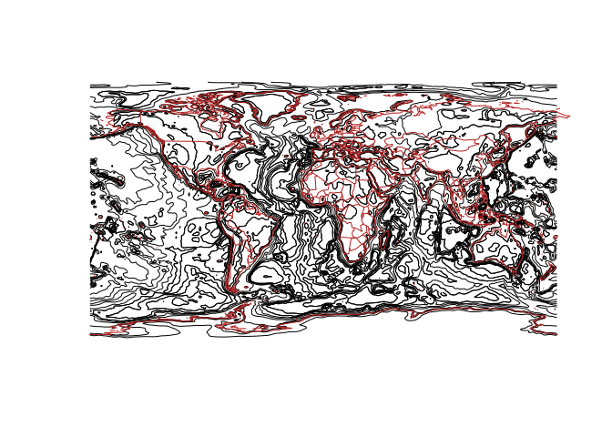
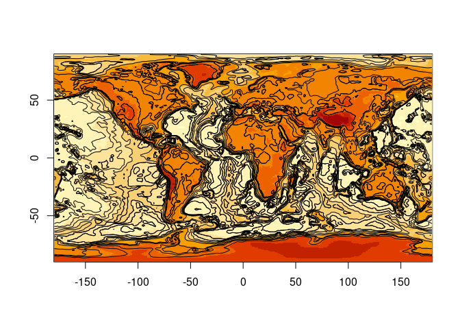

<!-- README.md is generated from README.Rmd. Please edit that file -->

# xisoband

<!-- badges: start -->

[](https://github.com/hypertidy/xisoband/actions/workflows/R-CMD-check.yaml)
<!-- badges: end -->

The goal of xisoband is to make isoband a bit more generally useable.

## Example

This is a basic example which shows you how to solve a common problem:

``` r
library(xisoband)
e <- whatarelief::elevation()
#> [1] "/vsicurl/https://public.services.aad.gov.au/datasets/science/GEBCO_2021_GEOTIFF/GEBCO_2021.tif"
plot(iso <- xisoband::xisobands(e, extent = c(-180, 180, -90, 90)))
#> [1] 256 512
maps::map(add = TRUE, col = "firebrick", fill = FALSE)
```



``` r

ximage::ximage(e, extent = c(-180, 180, -90, 90))
plot(iso, add = TRUE)
```



## Code of Conduct

Please note that the xisoband project is released with a [Contributor
Code of
Conduct](https://contributor-covenant.org/version/2/1/CODE_OF_CONDUCT.html).
By contributing to this project, you agree to abide by its terms.
