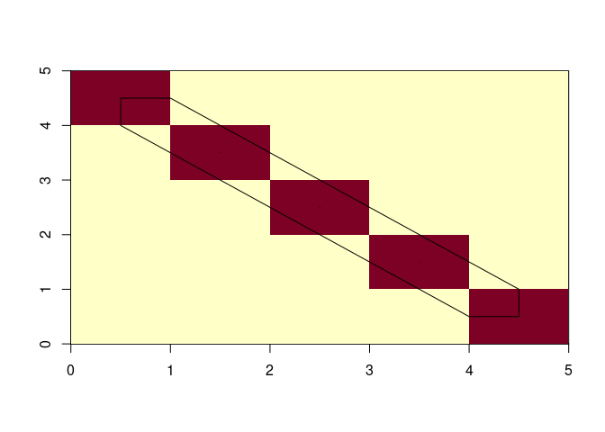

<!-- README.md is generated from README.Rmd. Please edit that file -->

# xisoband

<!-- badges: start -->

[](https://github.com/hypertidy/xisoband/actions/workflows/R-CMD-check.yaml)
<!-- badges: end -->

The goal of xisoband is to make isoband a bit more generally useable.

## Example

This example shows how to get the output of isoband as a *list of lists*
of matrices, and to simply plot it.

We avoid

-   creating redundant rectilinear vectors of `$x` and `$y`
-   requirement to specify levels (we auto them)
-   having to convert from iso type to sf to finish the job

``` r
library(xisoband)
e <- whatarelief::elevation()
#> [1] "/vsicurl/https://public.services.aad.gov.au/datasets/science/GEBCO_2021_GEOTIFF/GEBCO_2021.tif"
plot(iso <- xisoband::xisobands(e, extent = c(-180, 180, -90, 90)))
#> [1] 256 512
maps::map(add = TRUE, col = "firebrick", fill = FALSE)
```


``` r

ximage::ximage(e, extent = c(-180, 180, -90, 90))
plot(iso, add = TRUE)
```


We are using the hypertidy raster reader `elevation()` to get GEBCO 2021
elevation in a matrix, and ximage to plot it. The ‘hypertidy way’ is to
specify `extent` directly when it is required, not a mix of xmin,xmax or
xlim,ylim, or the degenerate rectlinear model used by `image()`.

The orientation is *raster-order*, which is used by the GDAL packages
and `rasterImage()`. There is a plot method for `isoband,iso` objects.

We otherwise would get an unuseable list of grouped `x,y,id` lists from
`isoband::isobands()`, or a list of `sfg` geometries (matrices in a list
with a class for sf) with `iso_to_sfg()` that further processes the
`isobands()` output .

The plot method uses `graphics::lines()` currently, but could use the
vectorized grid package plotting. It seems funny that isoband currently
returns an output that requires further clean up, *and* converts to sf.

If `extent` is not provided we treat the matrix as living in
`0:ncol,0:nrow` space.

We might contribute changes to isoband to clean this up, but first I
needed to be able to explore what’s already there.

A rough set of goals:

-   [ ] add vectorized `grid` package plotting
-   [ ] separate the raw `isobands()` output from the cleaned up version
    (in the same format)
-   [ ] separate the conversion to sf
-   [ ] put the geometry clean up deeper in the code, why do we want the
    raw `isobands()` output?, for example
-   [ ] record the grid attirbutes (dimension and extent) on the output
-   [ ] record the auto generated hi/lo levels

A simpler example, this shows the simplicity of not requiring even
extent as input, we simply assume the data lives in grid space, and we
have a convenient way to choose just one level (or none, but choosing
here gives a good result).

``` r
m <- diag(5)
(x <- xisobands(m, lo = .5))
#> [1] 5 5
#> $`0.5:1`
#> $`0.5:1`$x
#>  [1] 0.5 0.5 1.0 1.5 2.0 2.5 3.0 3.5 4.0 4.5 4.5 4.5 4.0 3.5 3.0 2.5 2.0 1.5 1.0
#> [20] 0.5 2.5 2.5 2.5 2.5 3.5 3.5 3.5 3.5 1.5 1.5 1.5 1.5
#> 
#> $`0.5:1`$y
#>  [1] 4.5 4.0 3.5 3.0 2.5 2.0 1.5 1.0 0.5 0.5 0.5 1.0 1.5 2.0 2.5 3.0 3.5 4.0 4.5
#> [20] 4.5 2.5 2.5 2.5 2.5 1.5 1.5 1.5 1.5 3.5 3.5 3.5 3.5
#> 
#> $`0.5:1`$id
#>  [1] 1 1 1 1 1 1 1 1 1 1 1 1 1 1 1 1 1 1 1 1 2 2 2 2 3 3 3 3 4 4 4 4
#> 
#> 
#> attr(,"class")
#> [1] "isobands" "iso"
ximage::ximage(m)
plot(x, add = TRUE)
```



## Code of Conduct

Please note that the xisoband project is released with a [Contributor
Code of
Conduct](https://contributor-covenant.org/version/2/1/CODE_OF_CONDUCT.html).
By contributing to this project, you agree to abide by its terms.
